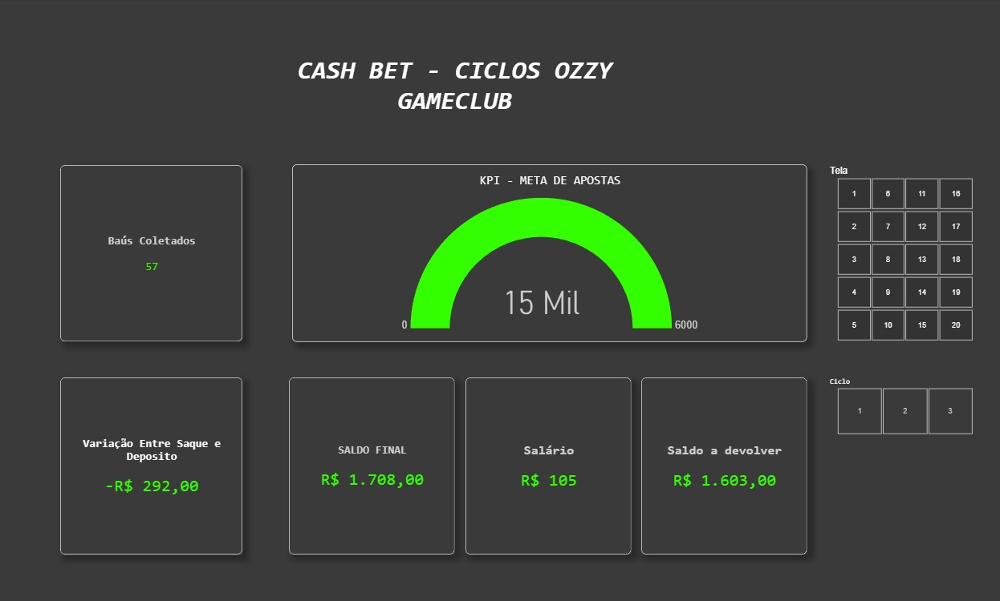

# 🚀 [PROJETO BI] Dashboard de Monitoramento Operacional e Financeiro – GameClub (Cash Bet)

### 📌 Resumo do Projeto

Desenvolvimento de um painel analítico executivo e operacional em **Power BI** para acompanhamento em tempo real da performance de apostas, metas por ciclo e controle financeiro de entradas e saídas da operação GameClub.

---

### 🎯 1. O Desafio (Situação-Problema)

Na operação dos ciclos de apostas do GameClub, os dados operacionais (valores apostados por tela, aportes/depósitos, saques, comissões/salários e bonificações) ficavam descentralizados em planilhas. Isso gerava três gargalos principais:

* **Falta de visibilidade do progresso:** Dificuldade em acompanhar o atingimento da meta global de apostas ($ 3.714,00 por ciclo).
* **Incerteza no saldo real:** Falta de consolidação entre depósitos efetuados e saques a devolver após cada operação.
* **Leitura lenta:** Necessidade de auditar tela por tela (20 telas por ciclo) de forma manual.

---

### 🛠️ 2. A Solução Desenvolvida

Para resolver esse cenário, criei um **Dashboard Dark Mode / Neon** focado em **Alta Performance Visual e UX/UI**, contendo:

1. **Acompanhamento de Meta por KPI Gauge:** Velocímetro dinâmico monitorando o volume acumulado de apostas versus o objetivo do ciclo em tempo real.
2. **Consolidação Financeira em DAX:**
* **Saldo Final:** Cálculo do saldo operacional líquido com base nos aportes base e movimentações.
* **Variação Saque x Depósito:** Identificação imediata do resultado do ciclo (lucro/prejuízo operacional).
* **Saldo a Devolver & Salários:** Controle exato dos valores pendentes de acerto e comissões.

3. **Filtros e Granularidade por Ciclo e Tela:**
* Implementação de **Slicers (Matriz/Blocos)** para navegação rápida entre os **Ciclos (1, 2 e 3)**.
* Seletor interativo por **Tela de Aposta (Telas 1 a 20)** para auditoria individualizada.

4. **Padronização de Interface (UI/UX):**
* Tema escuro com alto contraste para telas de acompanhamento contínuo.
* Padronização rigorosa de moedas (R$), casas decimais e separadores de milhar para eliminar erros de interpretação.

---

### 📈 3. Resultados e Impacto

* **Agilidade na Tomada de Decisão:** Redução drástica no tempo de fechamento e auditoria ao final de cada ciclo.
* **Transparência Operacional:** Acompanhamento visual e intuitivo de metas tanto no nível macro (Ciclo completo) quanto micro (Tela específica).
* **Zero Ambiguidade:** Padronização de indicadores financeiros garantindo clareza total sobre o saldo líquido a devolver.

---

### 💻 Tecnologias e Conceitos Aplicados

* **Ferramenta:** Power BI Desktop
* **Linguagem:** DAX (Medidas personalizadas de agregação, variação e formatação)
* **Fonte de Dados:** Google Sheets / Excel
* **UI/UX:** Design Dark Mode, Card Layouts, Tipografia e Hierarquia Visual
* **Inteligência Artificial (IA Generativa)**: Utilizada como ferramenta de apoio técnico e de design para aceleração do desenvolvimento, otimização de fórmulas DAX avançadas, resolução de gargalos de modelagem e refinamento de UX/UI.

---
